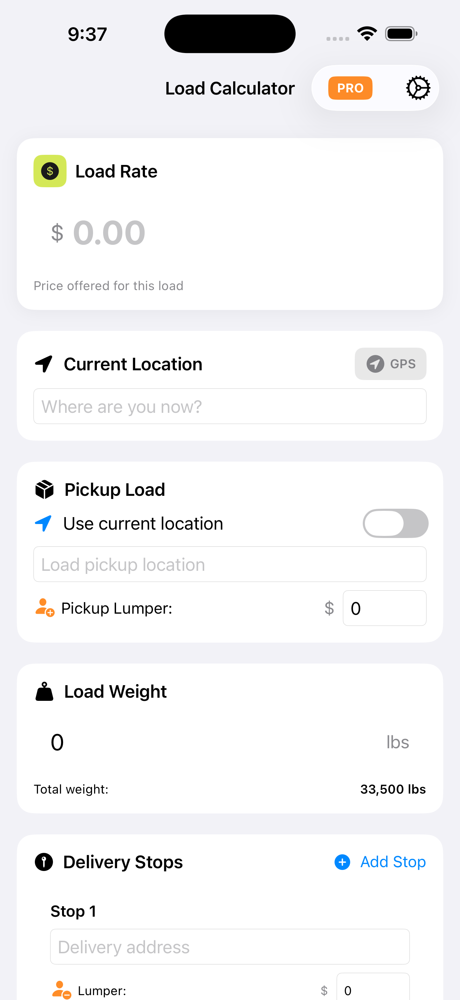
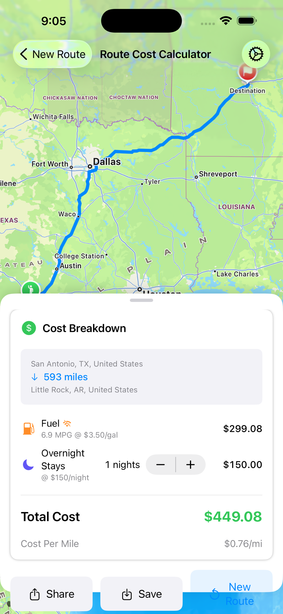
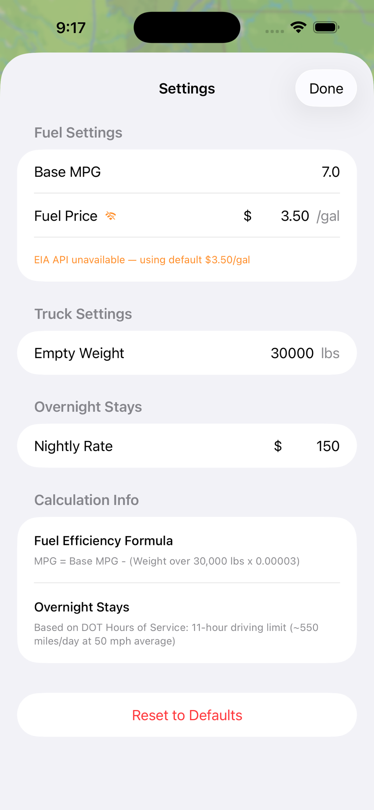

# ROL: Return on Load

**Calculate the true cost of every haul before you hit the road.**

A professional iOS app for truck drivers, owner-operators, and fleet managers to accurately estimate route costs including fuel, overnight stays, and per-mile profitability.

[](https://testflight.apple.com/join/XXXX)
[](https://developer.apple.com/ios/)
[](https://swift.org)

---

## About This Project

This app demonstrates **AI-assisted software development** at production quality. The entire codebase—architecture, implementation, App Store deployment pipeline, and this documentation—was developed collaboratively with **Claude AI (Opus 4.5)**.

**What this demonstrates:**
- End-to-end iOS app development from concept to TestFlight
- MVVM architecture with SwiftUI and SwiftData
- Real-time API integration (EIA, Apple Maps)
- Automated CI/CD with Fastlane
- Production-ready code signing and App Store Connect integration

---

## Features

### Core Functionality
- **Smart Route Calculation** — Apple Maps integration for accurate distance and routing
- **Regional Diesel Pricing** — Live prices from EIA API by PADD region (East Coast, Midwest, Gulf Coast, Rocky Mountain, West Coast, California)
- **Weight-Based Fuel Estimation** — MPG automatically adjusts based on load weight using industry formulas
- **Overnight Stay Planning** — Auto-calculated from DOT Hours of Service (550 mi/day), manually adjustable
- **Cost Breakdown** — Fuel, overnight stays, total cost, and cost-per-mile

### Data & Persistence
- **Route History** — Save and reload previous calculations (SwiftData/on-device)
- **24-Hour Price Caching** — Reduces API calls while keeping prices current
- **Share Quotes** — Export cost summaries via Messages, Email, or any share target

### Technical
- **Zero Account Required** — All data stays on-device
- **Offline Capable** — Cached prices work without connectivity
- **Privacy First** — No analytics, no tracking, no backend

---

## Screenshots

| Input | Route Results | Settings | History |
|-------|---------------|----------|---------|
|  |  |  |  |

---

## Technical Architecture

```
┌─────────────────────────────────────────────────────────────┐
│                         SwiftUI Views                        │
│  ContentView → RouteInputView / CostSummaryView / SettingsView│
└─────────────────────────────────────────────────────────────┘
                              │
                              ▼
┌─────────────────────────────────────────────────────────────┐
│                   RouteCalculatorViewModel                   │
│              @Published state + business logic               │
└─────────────────────────────────────────────────────────────┘
                              │
              ┌───────────────┼───────────────┐
              ▼               ▼               ▼
       ┌───────────┐   ┌───────────┐   ┌───────────┐
       │AppleMap   │   │FuelPrice  │   │Cost       │
       │Service    │   │Service    │   │Calculator │
       └───────────┘   └───────────┘   └───────────┘
              │               │
              ▼               ▼
       ┌───────────┐   ┌───────────┐
       │Apple Maps │   │EIA API    │
       │   API     │   │(Diesel)   │
       └───────────┘   └───────────┘
```

### Key Technologies
| Component | Technology |
|-----------|------------|
| UI Framework | SwiftUI (iOS 17+) |
| Persistence | SwiftData |
| Maps/Routing | MapKit / Apple Maps |
| Fuel Prices | U.S. Energy Information Administration API |
| Architecture | MVVM |
| Deployment | Fastlane + App Store Connect API |

---

## Regional Diesel Pricing

Prices are fetched by PADD (Petroleum Administration for Defense Districts) region:

| Region | States |
|--------|--------|
| **East Coast** | ME, NH, VT, MA, RI, CT, NY, NJ, PA, DE, MD, DC, VA, WV, NC, SC, GA, FL |
| **Midwest** | OH, MI, IN, IL, WI, MN, IA, MO, ND, SD, NE, KS, OK, KY, TN |
| **Gulf Coast** | TX, LA, MS, AL, AR, NM |
| **Rocky Mountain** | MT, ID, WY, CO, UT |
| **West Coast** | WA, OR, NV, AZ, AK, HI |
| **California** | CA (separate due to state regulations) |

Prices are cached locally for 24 hours and automatically refresh.

---

## Fuel Efficiency Formula

```
effectiveMPG = baseMPG - (totalWeight - 30,000) × 0.00003
```

| Load Weight | Effective MPG (Base 7.0) |
|-------------|--------------------------|
| 30,000 lbs (empty) | 7.0 MPG |
| 50,000 lbs | 6.4 MPG |
| 80,000 lbs (max legal) | 5.5 MPG |

Floor: 4.0 MPG minimum to prevent unrealistic values.

---

## Development Setup

### Prerequisites
- Xcode 15.0+
- iOS 17.0+ deployment target
- EIA API key (free): https://www.eia.gov/opendata/

### Build & Run
```bash
# Clone repository
git clone https://github.com/trent-alex/trucking_ROL.git
cd trucking_ROL/TruckRouteCalculator

# Open in Xcode
open TruckRouteCalculator.xcodeproj

# Set your EIA API key in Utilities/Constants.swift
# Build and run (⌘R)
```

### Deploy to TestFlight
```bash
# Install dependencies
bundle install

# Upload to TestFlight
fastlane ios beta
```

---

## Project Structure

```
TruckRouteCalculator/
├── Models/
│   ├── Route.swift              # Route data with coordinates
│   ├── SavedRoute.swift         # SwiftData persistence model
│   ├── CostBreakdown.swift      # Cost calculation results
│   └── LoadConfig.swift         # Weight configuration
├── Views/
│   ├── ContentView.swift        # Main container + bottom sheet
│   ├── RouteInputView.swift     # Origin/destination with autocomplete
│   ├── RouteMapView.swift       # Apple Maps with route polyline
│   ├── CostSummaryView.swift    # Cost breakdown display
│   ├── RouteHistoryView.swift   # Saved routes list
│   └── SettingsView.swift       # Configuration
├── ViewModels/
│   └── RouteCalculatorViewModel.swift  # State management
├── Services/
│   ├── AppleMapService.swift    # MapKit integration
│   ├── FuelPriceService.swift   # EIA API + regional pricing
│   └── CostCalculator.swift     # Business logic
├── Utilities/
│   └── Constants.swift          # Configuration defaults
└── fastlane/
    ├── Fastfile                 # Deployment lanes
    └── metadata/                # App Store metadata
```

---

## Built With AI

This project showcases what's possible when combining domain expertise with AI-assisted development:

- **Planning** — Architecture decisions, API selection, feature prioritization
- **Implementation** — All Swift/SwiftUI code, including MapKit integration
- **DevOps** — Fastlane configuration, code signing, App Store Connect setup
- **Documentation** — README, App Store metadata, inline comments

The collaboration model: Human provides requirements, context, and decisions. AI provides implementation, best practices, and iteration velocity.

**Developer:** Trent Alexander
**AI Assistant:** Claude Opus 4.5 (Anthropic)

---

## License

MIT License — see [LICENSE](LICENSE) for details.

---

<p align="center">
  <strong>Pivotal Lift LLC</strong><br>
  <a href="mailto:helpnow@pivotallift.com">helpnow@pivotallift.com</a>
</p>
